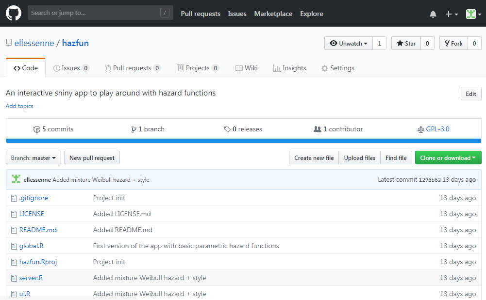
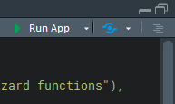

# hazfun

HazFun is an interactive shiny app designed to play around with hazard functions.

# How to use

You can access the web app hazfun [here](https://ag475.shinyapps.io/hazfun/).

Alternatively, you can downloading for local use if you don't have access to the Internet:

1. download the app by clicking the green button **Clone or download** on the top right of this GitHub page:

2. unzip the downloaded folder;
3. double click the `hazfun.Rproj` file to open the RStudio project;
4. open the `ui.R` file;
5. click the `Run App` button:

# Feedback

If you have any feedback, please [open an Issue on GitHub](https://github.com/ellessenne/hazfun/issues) or [email me](mailto:ag475@leicester.ac.uk).
